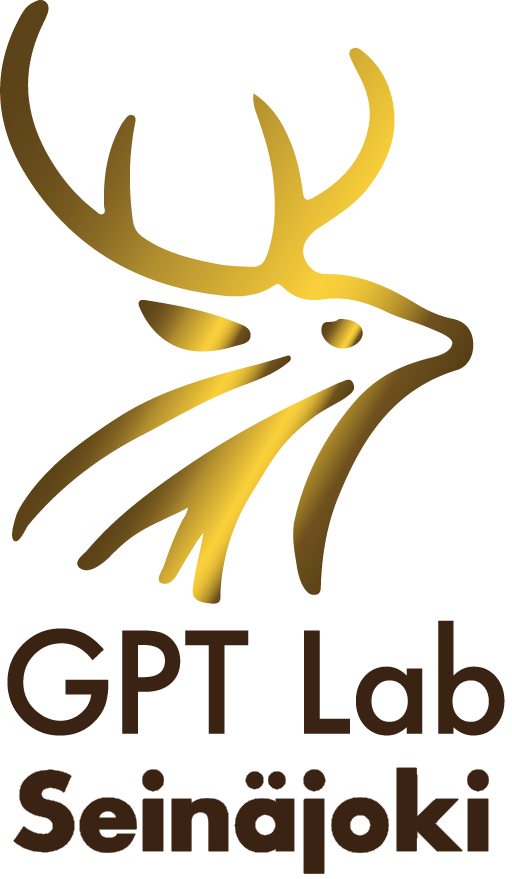

# AI-Agent Powered Code Generation and Docker Setup

## Introduction

This project demonstrates the use of language models and AI agents to fully automate the process of generating code based on user input, setting up a Docker environment, and creating documentation for the project, including README.md and developer.md files. The AI agents collaborate to analyze the user’s request, generate the necessary code, configure Docker, and produce relevant documentation.

Each task in the workflow is handled by a specific agent. This includes analyzing the user's input, generating program code, setting up the required Docker environment, and finally ensuring that all project files, including code and documentation, are produced correctly. An additional agent manages error handling during Docker startup or code execution.

The main goal of the project is to explore the potential of language models and AI agents in automating the entire software development process, from code generation to deployment. By leveraging Docker, the generated programs can run across various programming languages in an isolated environment. Currently, the project supports small-scale program generation, but additional work is required for larger, more complex systems, particularly in areas such as code modularization and robust error handling.

This project was developed in Python and uses the OpenAI API to integrate large language models. We also employed LangChain and LangGraph for managing AI agent workflows, and Chainlit for the user interface.

## Features

- **Code Generation**: Based on user-provided input, AI agents generate fully functional program code.
- **Docker Environment Setup**: Automatically configures a Docker environment to run the generated code.
- **Automated Documentation**: AI agents generate documentation for the project, including README.md.
- **Error Handling**: Handles errors in Docker startup and code execution.

## Technologies Used

- **Python**: Core language for project development.
- **OpenAI API**: Provides the large language model for generating code and handling input.
- **LangChain**: Framework for integrating language models into the application.
- **LangGraph**: Manages workflows and interactions between AI agents.
- **Chainlit**: Used to create the user interface for the project.
- **Docker**: Ensures that generated programs run in isolated environments.

## Installation

1. start venv -> .\.venv\Scripts\activate
2. install packages -> pip install -r requirements.txt
3. create .env file with own keys for openai
   1. OPENAI_API_KEY
4. create config.ini
   1. [LLM]
      model=gpt-4o-mini
5. run program -> python main.py

## Future Improvements

- Improve code modularization for larger projects.
- Enhance error checking and handling capabilities.
- Expand support for additional programming languages and frameworks.

# GPT Lab Seinäjoki

**This project under the GPT Lab Seinäjoki program supports the regional strategy of fostering an innovative ecosystem and advancing smart, skilled development. Its goal is to introduce new AI knowledge and technology to the region, enhance research and innovation activities, and improve business productivity.**

## License

This project is licensed under the MIT License. See the [LICENSE](LICENSE) file for details.

